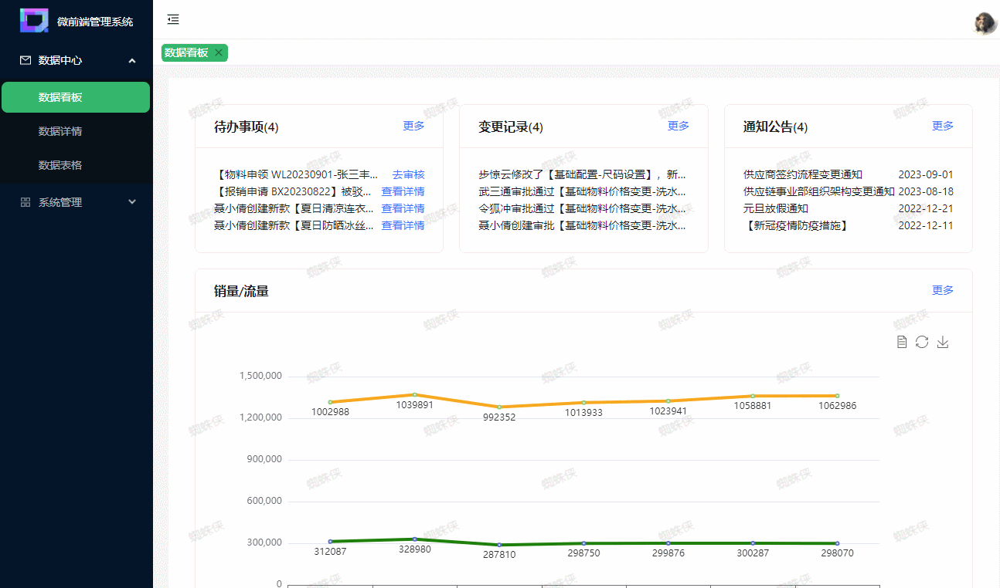
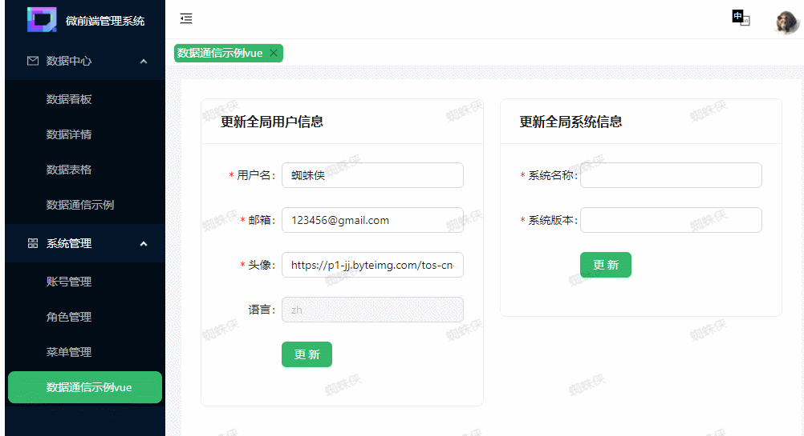
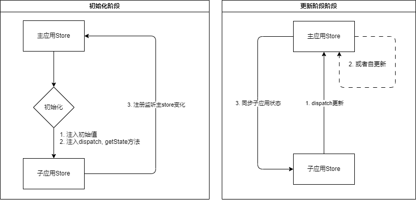

<p align="center"></p>

# qiankun-admin

免费开源的中后台模版。使用了最新的`qiankun`, `Vue3`, `Webpack5`, `Vite4`, `React18`, `TypeScript`等主流技术框架，开箱即用的中后台前端解决方案。具备基础的应用界面，开发与构建配置，应用状态管理，图表图形界面，页面tabs缓存控制等能力。



### 技术栈
- 主应用: `React18`+`Webpack5`+`qiankun`+`antd`+`react-redux`+`Typescript`
- 子应用1: `React18`+`Vite`+`antd`+`react-redux`+`Typescript`
- 子应用2: `Vue3`+`Vite`+`antd for vue`+`pinia`+`Typescript`
- mock服务: `koa`

## 启动服务

首先在根文件夹，mock文件夹，以及sub-projects下的`react-admin`,`vue-admin`文件夹下都执行`npm install`进行依赖安装。

主应用使用`webpack5`+`React18`搭建。
子应用分别使用`vite`+`Vue3`与`vite`+`React`搭建。
数据mock服务使用`koa`搭建。

直接启动：
- 在根目录运行`npm run start-all`启动以下四个服务

分别启动：
- 在根目录运行`npm run start`启动主服务
- 在根目录运行`npm run start-sub-vue`启动vue3子应用服务
- 在根目录运行`npm run start-sub-react`启动react18子应用服务
- 在根目录运行`npm run start-mock`启动接口mock服务

### 目录结构

```txt
├── mock // mock服务
├── src // 主应用
├── sub-projects // 子应用
│   ├── react-admin // react子应用
│   └── vue-admin // vue3子应用
```

## 应用状态同步

主应用与子应用分别拥有自己的状态，React主应用与子应用皆使用`react-redux`与`@reduxjs/toolkit`创建全局状态管理。Vue子应用则用官方推荐的`Pinia`库。





相关方法使用:
1. 主应用`src/store/connectMainStore.ts`与`src/qiankun.ts`
  - 其中`src/store/connectMainStore.ts`暴露出`connect`方法，接收一个字符串数组参数。用以指明哪些`state`需要与子应用共享。
  - `connect`方法返回值为`connectReactStore`与`connectVueStore`。分别提供给React与Vue子应用使用。通过`qiankun`的`props`传递。
2. 子应用中，接收到`connectReactStore`与`connectVueStore`, 分别与自身`store`关联（注册监听以及同步初始值）。同时为了让主应用能够同步状态，分别需要在对应store中声明指定action。
3. 子应用中分别通过`context`与`Provide/inject`向全局提供主应用的`dispatch`方法。

定义一个共享store步骤:
主应用：
1. 先在主应用创建`reducer`，参照已有的`reducer`实现。然后正常在`store/index.ts`使用即可。
2. 在主应用的`src/qiankun.ts`中，向子应用的`props.store`中添加刚刚创建的state名称，如已有的`store: connect(['userState', 'configState'])`。

子应用：
1. 在子应用中创建同样的`reducer`或者`store`(对vue)。
2. 在react子应用中，正常注册`reducer`即可, 但是在`reducer`中，需要实现`set[StateName]State`的action, 主应用数据变更时，会调用该action全量更新该state的数据。
3. 在vue子应用中，则需要实现`setStoreState`的action。另外，在vue子应用的`src/qiankun.ts`文件中，需要调用`connectVueStore`手动关联store，因为毕竟跟`react-redux`的用法不同。

数据更新：
1. 在触发数据变更时，直接调用主应用的`dispatch`, 然后再由主应用的`subscribe`回调触发子应用的`store`更新。所以在子应用中向全局注入了特殊的`dispatch`方法，直接使用封装好的`useMainStoreDispatch`即可。

## 构建部署

运行 `npm run deploy-all`, 然后打开`127.0.0.1:8010`即可看到构建后的应用状态，跟开发环境运行效果是一致的。

主应用的scripts中虽然已经有部署命令了，但是这个部署是本地打包并通过`http-server`跑起来构建后的项目。实际部署中根据各人需要，要修改各个项目的环境变量。
并且微前端应该各个系统独立开发独立部署的，实际应用的时候再独立拆分部署逻辑即可。并且子应用开发环境也应该是可以引用构建后的模块联邦依赖的，就不需要开发的时候将所有应用服务都启动起来了。

1. 主应用
在`webpack/webpack.config.prod.js`中通过`DefinePlugin`注入了变量。
```txt
  REACT_SUB_PRODUCT_HOST: `'//127.0.0.1:8011'`, // 子应用1的host
  VUE_SUB_PRODUCT_HOST: `'//127.0.0.1:8012'`, // 子应用2的host
  API_HOST: `'http://localhost:7999'`, // 接口host
  MAIN_HOST: `'http://127.0.0.1:8010'` // 主应用部署后的host
```
2. 子应用
子应用由于是使用vite搭建的，所以环境变量在根目录的`.env.[mode]`文件中, `APP_HOST` 为当前应用部署后的host地址, `FEDERATION_HOST` 为主应用部署后的host地址
```txt
FEDERATION_HOST=http://127.0.0.1:8010
APP_HOST=http://127.0.0.1:8011/
```

## 功能

1. 多语言 ✅
3. 基础图表 ✅
4. 基础表单 ✅
5. 页面tab缓存 ✅
6. 全局数据状态管理封装 ✅
7. 模块联邦共享全局模块 ✅
8. 构建 ✅
9. 子应用单独启动开发
10. 编码规范eslint&提交规范husky
